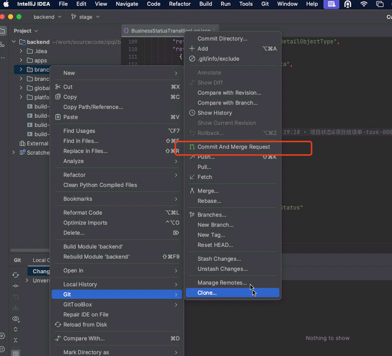
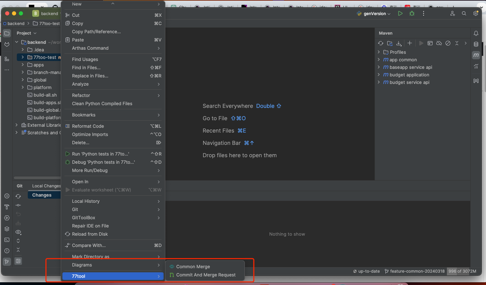
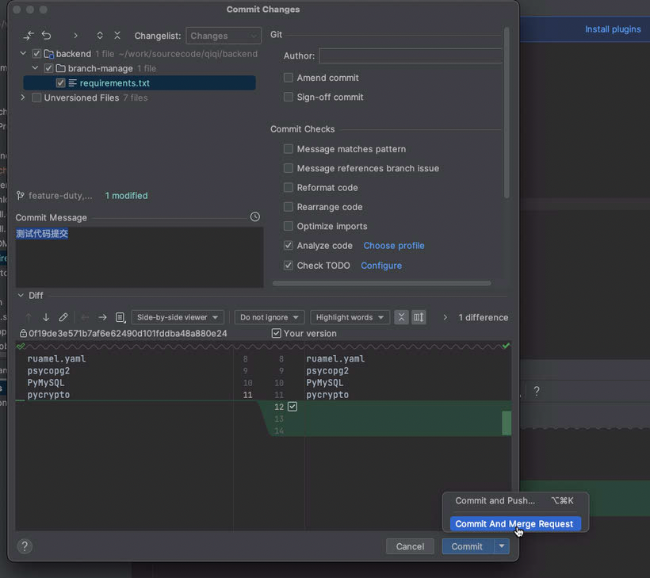
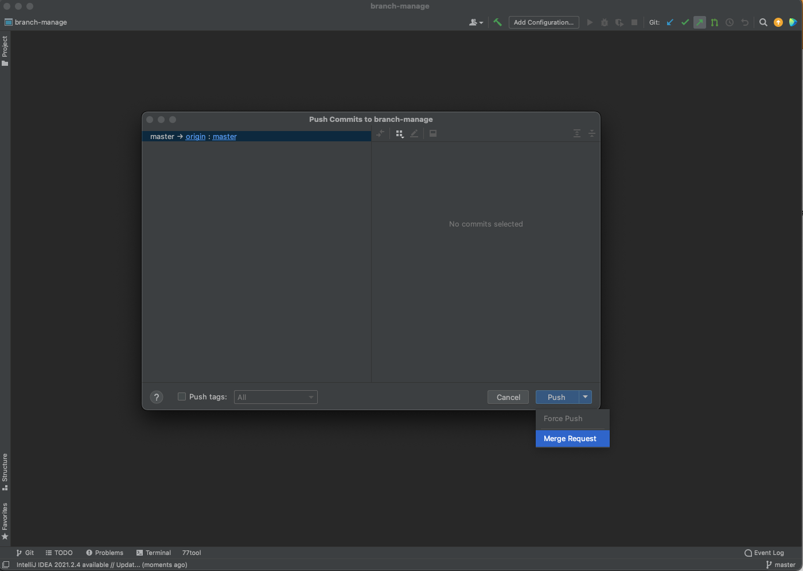
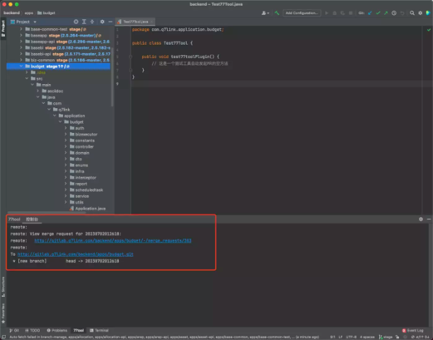
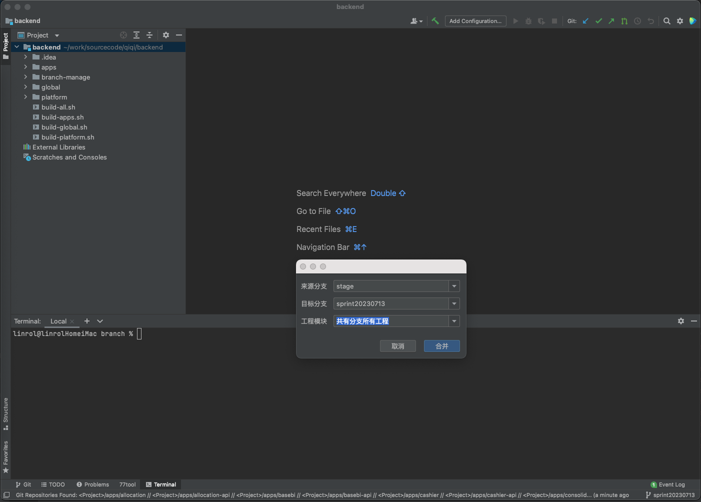
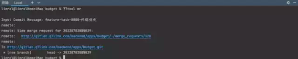

# 安利一款IDEA小插件(原生无后门可维护😁) 77tool

有什么用？平时工作中直接在保护（不允许PUSH，可MR）分支修改完Bug，发起MR的流程繁琐如下？

> 创建一个临时分支

> 提交代码并推送至远程

> 打开浏览器发起MR

> 等合并后删除本地临时分支

现在它来了，只需在IDEA的Git提交工具变更窗口选择Commit An Merge Request即可搞定以上所有步骤，并在控制台输出MR链接（安装方法：下载jar包 --- IDEA --- Settings --- Plugins --- 按钮"Install plugin from disk..."）

纳尼？平时习惯只敲命令使用GIT不喜欢插件方式？

[Emm]本次除了插件版也支持二进制命令版，使用pip3 install 77tool安装命令包。

Usage：77tool mr

# 下载
Release 发布页面下载Latest版下载（version 1.1.0）

# 更新日志
<!-- Plugin description -->
77tool for branch management tools for created merge request and multi modules common branch merge 
<ul>
<li>Quick created merge request of the selected project and show mr/pr url</li>
<li>Support branch merge of multi modules auto resolve conflicts for pom.xml</li>
<li>Print merge request in console for copy</li>
</ul>
 
The supported git hosting services are GitHub, GitLab, Gitee.  
<a href="https://github.com/linrol/77tool">Source</a> |
<a href="https://github.com/linrol/77tool/issues">Issues</a>
<!-- Plugin description end -->

# 使用截图（IDEA插件版）

# 使用截图（命令版）

