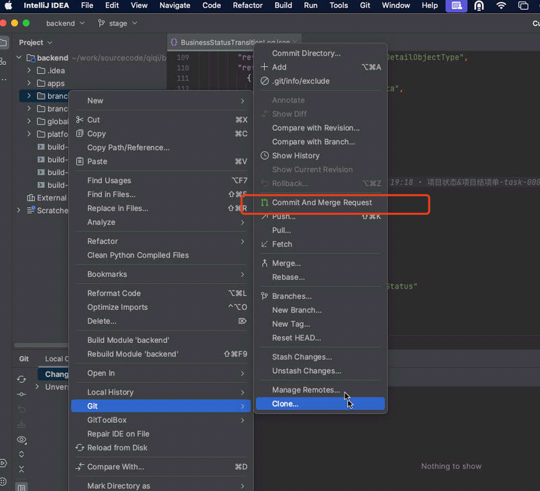
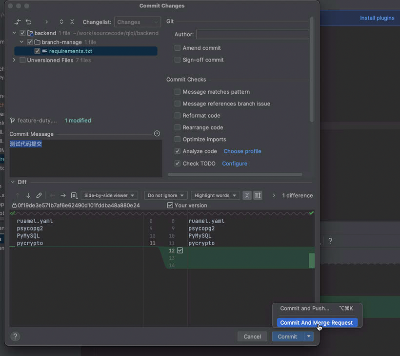
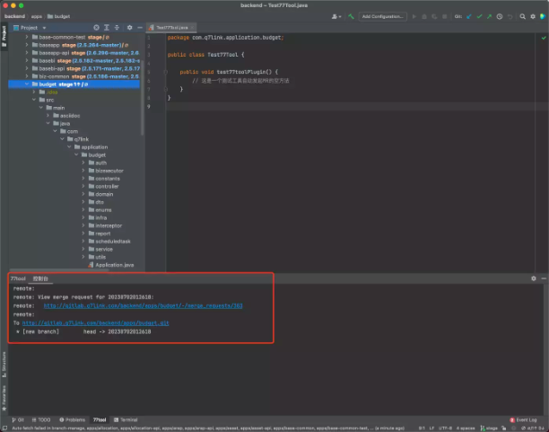

# 安利一款IDEA小插件(原生无后门可维护😁) 77tool

有什么用？平时工作中直接在保护（不允许PUSH，可MR）分支修改完Bug，发起MR的流程繁琐如下？

> 创建一个临时分支

> 提交代码并推送至远程

> 打开浏览器发起MR

> 等合并后删除本地临时分支

现在它来了，只需在IDEA的Git提交工具变更窗口选择Commit An Merge Request即可搞定以上所有步骤，并在控制台输出MR链接（安装方法：下载jar包 --- IDEA --- Settings --- Plugins --- 按钮"Install plugin from disk..."）

纳尼？平时习惯只敲命令使用GIT不喜欢插件方式？

[Emm]本次除了插件版也支持二进制命令版，使用pip3 install 77tool安装命令包。

Useag：77tool mr

# 下载
Release 发布页面下载Latest版下载（version 1.0.5）

# 更新日志
<!-- Plugin description -->
**Version 1.0.5**

* **Integrate create merge request into git menu****（**集成功能到IDEA自带的提交变更工具窗口中**）**
* **For create merge request set icon****（**为操作按钮添加图标**）**

**Version 1.0.4**
* **Support after Idea 182（**支持IDE2018.2之后的版本**）**
* **Fix files that are not under Git version management and should not be submitted（**修复未受Git版本管理未被跟踪的文件不应该被提交**）**
* **Fix the problem of not creating an empty MR after canceling the operation in the input submission information window（**修复输入提交信息窗口取消操作后不创建空MR**）**
* **Fix the problem of not creating an empty MR when the current branch HEAD is consistent with the remote branch（**修复当前分支HEAD和远程分支一致时不创建空MR**）**

**Version 1.0.3**
* **Support after Idea 191 after**
* **switch Git4Idea plugin****invoke****git**
<!-- Plugin description end -->

# 使用截图（IDEA插件版）

# 命令版（IDEA插件版）

